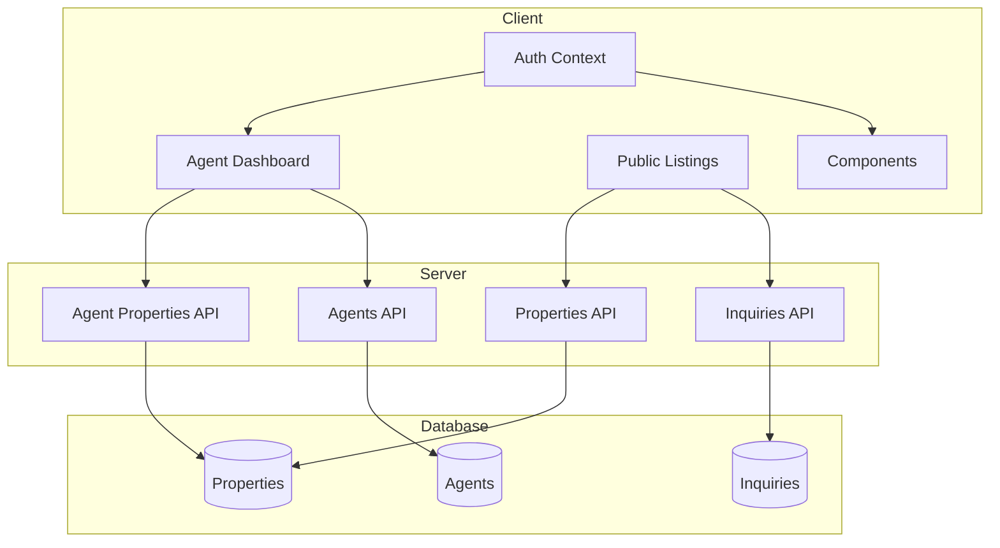

# ProperView - Real Estate Listing Platform

A full-stack real estate listing and management platform used by agents to manage property listings, track inquiries, and view analytics. This platform should feature Zillow-like polish and professional UX.

## 🧩 User Stories/Scenarios

### Feature: Agent Listing Management

**Scenario: Agent logs in**
Given the user is on the login page  
When they enter their name and click "Log In"  
Then they are redirected to the agent dashboard

**Scenario: Agent creates a property listing**
Given the agent is on their dashboard  
When they click "Add Listing" and fill in the details  
Then the new listing appears in their property list

**Scenario: Agent edits a listing**
Given the agent is viewing one of their properties  
When they click "Edit" and update the price and description  
Then the changes are saved and shown in the listing

**Scenario: Agent deletes a listing**
Given the agent is on their dashboard  
When they click "Delete" on a property  
Then the listing is removed from their view

### Feature: Public Browsing and Inquiry

**Scenario: Visitor filters listings**
Given the visitor is on the public listings page  
When they select a price range and number of bedrooms  
Then only listings matching the criteria are shown

**Scenario: Visitor views listing details**
Given the visitor is on the listing results page  
When they click a listing card  
Then they are taken to a page with full property details

**Scenario: Visitor submits an inquiry**
Given the visitor is on a property detail page  
When they fill out the contact form and click "Submit"  
Then the inquiry is recorded and a confirmation message is shown

## ✅ Completed Tasks
- [x] Project initialization with Next.js + TypeScript
  - [x] 🔴 Write test for basic app functioning
  - [x] 🟢 Create Next.js project with TypeScript
  - [x] 🔵 Configure ESLint and Prettier
- [x] Setup Prisma with SQLite
  - [x] 🔴 Write test for database connection
  - [x] 🟢 Install and configure Prisma with SQLite
  - [x] 🔵 Create Prisma client singleton
- [x] Configure Tailwind CSS
  - [x] 🔴 Write test for Tailwind classes
  - [x] 🟢 Install and configure Tailwind CSS
  - [x] 🔵 Create basic color scheme and typography settings
- [x] Database Schema Implementation
  - [x] 🔴 Write tests for schema validation
  - [x] 🟢 Create Prisma models for:
    - [x] Property with fields:
      - [x] title
      - [x] price
      - [x] address
      - [x] bedrooms
      - [x] bathrooms
      - [x] description
      - [x] status ('active', 'pending', 'sold')
    - [x] Agent (simple model)
    - [x] Inquiry (from potential buyers)
  - [x] 🔵 Add indexes and relationships
- [x] Database Seed Script
  - [x] 🔴 Write tests for seed functionality
  - [x] 🟢 Create seed script with sample properties and one agent
  - [x] 🔵 Add validation to ensure seed data quality
- [x] Mock Authentication System
  - [x] 🔴 Write tests for mock login functionality
  - [x] 🟢 Implement simple login form (no real auth, just local storage)
  - [x] 🔵 Add protected routes based on mock authentication state
- [x] Agent Dashboard Implementation
  - [x] 🔴 Write tests for dashboard component rendering
  - [x] 🟢 Create agent dashboard layout with:
    - [x] Property listing overview
    - [x] Add new property button
    - [x] Action menu for each property
  - [x] 🔵 Refactor for better component organization
- [x] Property Creation Form
  - [x] 🔴 Write tests for form validation and submission
  - [x] 🟢 Implement form with all required fields:
    - [x] Title
    - [x] Price
    - [x] Address
    - [x] Bedrooms
    - [x] Bathrooms
    - [x] Description
    - [x] Status ('active', 'pending', 'sold')
  - [x] 🔵 Add form validation and error handling
- [x] Property Edit Functionality
  - [x] 🔴 Write tests for edit functionality
  - [x] 🟢 Implement edit form (reusing components from creation form)
  - [x] 🔵 Add confirmation of changes and success messages
- [x] Property Deletion
  - [x] 🔴 Write tests for delete functionality
  - [x] 🟢 Add delete confirmation modal
  - [x] 🔵 Implement optimistic UI updates for better UX
- [x] Public Listings Page
  - [x] 🔴 Write tests for listings display
  - [x] 🟢 Implement grid/list view of properties
  - [x] 🔵 Add responsive layout for all screen sizes
- [x] Property Filtering System
  - [x] 🔴 Write tests for filter functionality
  - [x] 🟢 Implement filters for:
    - [x] Price range (min/max)
    - [x] Number of bedrooms
    - [x] Location search
  - [x] 🔵 Add real-time filter updates and clear filter option
  - [x] 🔵 Filters are now persisted in the URL query string, so filter state is preserved when navigating to property details and back, and can be shared/bookmarked.
- [x] Property Detail Page
  - [x] 🔴 Write tests for property detail display
  - [x] 🟢 Create detailed view with all property information
  - [x] 🔵 Add visual enhancements (image gallery placeholder, maps)
- [x] Inquiry Submission Form
  - [x] 🔴 Write tests for inquiry form
  - [x] 🟢 Create inquiry form with validation
  - [x] 🔵 Add success/error notifications
  - [x] 🔵 Implement email notification system
- [x] Basic Analytics Implementation
  - [x] 🔴 Write tests for analytics display
  - [x] 🟢 Add simple analytics dashboard showing:
    - [x] Number of views per listing
    - [x] Number of inquiries per listing
    - [x] Days on market
  - [x] 🔵 Create visual charts for better data representation
- [x] Professional UI Polish
  - [x] 🔴 Write tests for UI components and responsive behavior
  - [x] 🟢 Implement Zillow-like design elements:
    - [x] Clean, professional color scheme
    - [x] Consistent typography
    - [x] Proper spacing and visual hierarchy
    - [x] Modern card designs for properties
    - [x] Intuitive navigation
  - [x] 🔵 Add subtle animations and transitions for better UX
- [x] Accessibility Improvements
  - [x] 🔴 Write tests for accessibility compliance
  - [x] 🟢 Add proper ARIA labels and roles
  - [x] 🔵 Ensure keyboard navigation and screen reader support

## 📂 API Implementation
- [x] Properties API
  - [x] 🔴 Write tests for API endpoints
  - [x] 🟢 Implement `/api/properties` routes:
    - [x] GET (list/filter)
    - [x] POST (create)
    - [x] PATCH (update)
    - [x] DELETE
  - [x] 🔵 Add validation and error handling
- [x] Agent Properties API
  - [x] 🔴 Write tests for agent-specific endpoints
  - [x] 🟢 Implement `/api/agent/properties` for agent-specific operations:
    - [x] GET (list agent's properties)
    - [x] POST (create new property)
    - [x] PATCH (update property)
    - [x] DELETE (delete property)
  - [x] 🔵 Add mock authentication checks and ownership validation
- [x] Inquiries API
  - [x] 🔴 Write tests for inquiries submission
  - [x] 🟢 Create `/api/inquiries` endpoints:
    - [x] POST (submit new inquiry)
    - [x] GET (list inquiries for agent's properties)
  - [x] 🔵 Add validation and authentication checks
- [x] Inquiries API
  - [x] 🔴 Write tests for inquiries submission
  - [x] 🟢 Create `/api/inquiries` endpoint for submitting inquiries
  - [x] 🔵 Add validation and confirmation

## 📂 Project Structure
```
proper-view/
├── app/
│   ├── api/
│   │   ├── properties/
│   │   │   └── route.ts
│   │   ├── agent/
│   │   │   └── properties/
│   │   │       └── route.ts
│   │   └── inquiries/
│   │       └── route.ts
│   ├── agent/
│   │   └── dashboard/
│   │       └── page.tsx
│   ├── properties/
│   │   └── [id]/
│   │       └── page.tsx
│   ├── page.tsx
│   └── layout.tsx
├── components/
│   ├── agent/
│   │   ├── LoginForm.tsx
│   │   ├── Dashboard.tsx
│   │   └── PropertyForm.tsx
│   ├── properties/
│   │   ├── PropertyCard.tsx
│   │   ├── PropertyList.tsx
│   │   ├── PropertyDetail.tsx
│   │   └── FilterBar.tsx
│   ├── inquiries/
│   │   └── InquiryForm.tsx
│   └── ui/
│       ├── Button.tsx
│       ├── Card.tsx
│       ├── Modal.tsx
│       └── Input.tsx
├── lib/
│   ├── prisma.ts
│   ├── mockAuth.ts
│   └── utils.ts
├── prisma/
│   ├── schema.prisma
│   └── seed.ts
├── tests/
│   ├── components/
│   └── api/
└── public/
    └── images/
```

## 🔁 Development Workflow
For each task:
1. Write BDD scenarios if needed (following the Given-When-Then format)
2. Create failing tests (🔴 Red phase)
3. Implement minimum code to pass tests (🟢 Green phase)
4. Refactor for cleanliness and optimization (🔵 Blue phase)
5. Update this task list to reflect progress

## 📝 Relevant Files
- `prisma/schema.prisma`: Database schema [Status: 💡 Planned]
- `prisma/seed.ts`: Seed data for development [Status: 💡 Planned]
- `app/page.tsx`: Public listing page [Status: 💡 Planned]
- `app/agent/dashboard/page.tsx`: Agent dashboard [Status: 💡 Planned]
- `app/properties/[id]/page.tsx`: Property detail page [Status: 💡 Planned]
- `components/agent/LoginForm.tsx`: Mock authentication [Status: 💡 Planned]
- `components/properties/PropertyCard.tsx`: Property display [Status: 💡 Planned]
- `components/properties/FilterBar.tsx`: Filter controls [Status: 💡 Planned]

## 🛠 Tech Stack
- Next.js with App Router
- TypeScript
- Prisma ORM with SQLite
- Tailwind CSS
- Jest + React Testing Library
- Mock authentication (localStorage based)

## Technical Decisions & Lessons Learned

### Authentication & Agent Property Filtering

- **Agent Login:**
  - On login, the app looks up the agent by name via an API endpoint (`/api/agents?name=...`).
  - If the agent exists, their `agentId` is stored in localStorage for session management.
  - If not found, an error is shown to the user.
- **Dashboard Filtering:**
  - The agent dashboard fetches only properties for the logged-in agent by passing `agentId` as a query parameter to `/api/agent/properties?agentId=...`.
  - The backend API supports filtering by `agentId` from the query string, falling back to mockAuth if not provided.
- **Mock Auth:**
  - The mock authentication system is robust, tying the session to a real agent in the database.
  - This enables realistic multi-agent testing and property filtering.
- **Hydration & Loading:**
  - All protected pages wait for the auth state to hydrate before rendering or redirecting, preventing "flash" redirects and ensuring a smooth UX.

### Property Management & Analytics

- **Property View Tracking & Analytics:**
  - Dedicated API endpoint (`/api/properties/[id]/view`) increments the `views` field for a property, called from the property detail page on mount.
  - Analytics dashboard reflects property views and inquiries, and is agent-specific.
  - Inquiry counts are fetched using Prisma's `_count` and mapped to each property for analytics and dashboard display.
- **Server-side AgentId Handling:**
  - When creating a new property, the `agentId` is set server-side based on the logged-in agent's session (from localStorage), not from client input, ensuring data integrity.
  - Property creation and dashboard logic use this pattern, and redirects after property creation use `useEffect` to avoid React hydration errors.

### Data & API

- **Seed Data Improvements:**
  - The seed script creates multiple agents and distributes properties among them, with realistic addresses and randomized data.
  - Foreign key and unique constraint issues are resolved by deleting data in the correct order before reseeding.
- **API Design:**
  - All CRUD and analytics operations are handled via Next.js API routes.
  - Endpoints include `/api/properties`, `/api/agent/properties`, `/api/inquiries`, and `/api/agents`.
  - Prisma ORM is used for type-safe DB access and analytics (e.g., inquiry counts).

### UI/UX & Accessibility

- **Accessibility & UI Polish:**
  - Accessibility tests are added using `jest-axe`.
  - The homepage and major components are refactored for accessibility, including ARIA labels, keyboard navigation, and screen reader support.
  - UI is polished for a professional, Zillow-like look, with improved spacing, color, and component structure.
- **Component Structure:**
  - Modular, with clear separation between agent/admin and public components.
  - State management is handled via React Context and localStorage for authentication.

### General Lessons

- **Hydration is critical** for client-only auth; always block rendering/redirects until hydrated.
- **Never call hooks conditionally**—always call all hooks on every render.
- **Prisma's `_count`** is invaluable for analytics (e.g., inquiry counts).
- **Separation of concerns** (API, UI, state) makes the app easier to maintain and extend.
- **Mock auth is great for demos, but real apps need server-side auth!**
- **UI/UX polish and accessibility** are as important as backend correctness for a professional product.
- **Server/client code separation is critical:** avoid using browser-only APIs (like localStorage) in server code.
- **Always validate ownership and session state on the server, not just the client.**
- **Documenting technical decisions and lessons learned** in this file helps maintain clarity and consistency as the project evolves.

### Filter State Persistence (URL-based)

- **URL-based Filter Persistence:**
  - The public listings page now syncs all filter state (location, price, bedrooms, status toggle) with the URL query string.
  - When a user changes a filter, the URL updates in real time.
  - When navigating to a property detail and back, filters are restored from the URL, providing a seamless UX.
  - This approach makes filtered results shareable and bookmarkable, and is idiomatic for modern React/Next.js apps.
  - The `ListingsClient` and `FilterBar` components were refactored to support controlled filter state and URL sync.

---

### Architecture Overview



---

### How It All Works

1. **Agent logs in** (mock, via localStorage/context).
2. **Agent Dashboard**:
    - Fetches agent's properties from `/api/agent/properties`.
    - Each property includes analytics (views, inquiry count).
    - Can add, edit, or delete properties (API routes).
3. **Public Listings**:
    - Fetches all active properties from `/api/properties`.
    - Users can filter, view details, and submit inquiries.
    - Inquiries are saved via `/api/inquiries`.
4. **Analytics**:
    - Dashboard displays property views and inquiries using data from the DB (via Prisma's `_count`).
5. **Hydration**:
    - All protected pages wait for auth state to hydrate before rendering or redirecting.

## Considerations: Database Choices

### Why SQLite?
- **Simplicity:** SQLite is file-based and requires zero setup—perfect for local development, prototyping, and coding challenges.
- **Portability:** The entire database is a single file, making it easy to share, back up, or reset.
- **Performance:** For small to medium datasets and low concurrency, SQLite is extremely fast and reliable.
- **Integration:** Prisma ORM supports SQLite out of the box, making schema management and migrations easy.

### When to Consider PostgreSQL or MySQL
- **Scalability:** For production environments with many users or high write concurrency, a server-based database like PostgreSQL or MySQL is preferred.
- **Advanced Features:** PostgreSQL offers powerful features such as full-text search, JSONB columns, advanced indexing, and robust transaction support.
- **Cloud Hosting:** Most cloud providers offer managed PostgreSQL/MySQL, making scaling and backups easier.

### What About MongoDB?
- **NoSQL Flexibility:** MongoDB is a document-based (NoSQL) database, which can be great for unstructured or rapidly evolving data models.
- **Horizontal Scaling:** MongoDB is designed for easy sharding and scaling across many servers.
- **Tradeoffs:** For this project, a relational model (properties, agents, inquiries) is a natural fit for SQL databases. Prisma also supports MongoDB, but with some feature limitations compared to SQL.

### How to Switch Databases with Prisma
- **Easy Migration:** Prisma's schema is database-agnostic. To switch from SQLite to PostgreSQL or MySQL:
  1. Update your `DATABASE_URL` in `.env`.
  2. Run `npx prisma migrate deploy` to apply migrations.
  3. Update any database-specific queries if needed (rare for most CRUD apps).
- **Production Ready:** For a real-world deployment, PostgreSQL is a common choice for reliability, scalability, and ecosystem support.

**Summary:**  
SQLite is ideal for development and demos. For production, consider PostgreSQL or MySQL for scalability and robustness. MongoDB is an option for document-based or highly flexible data needs, but for this relational app, SQL is a natural fit.
 